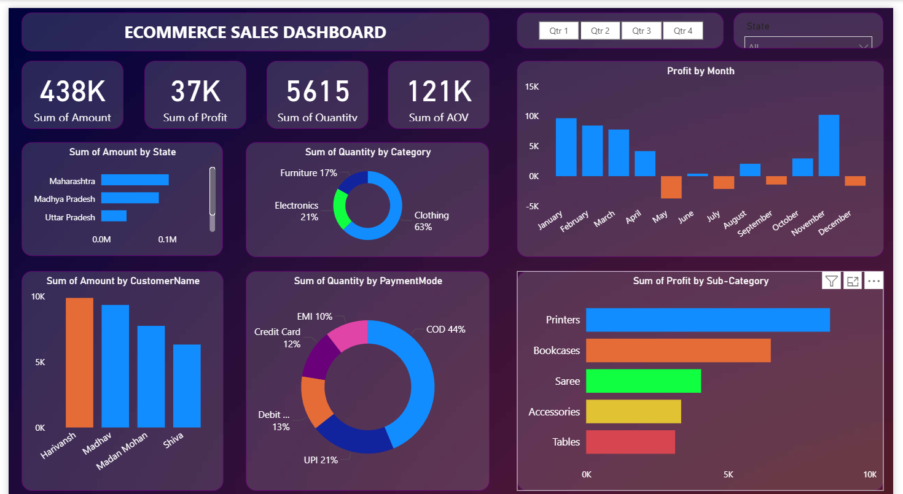

# E-commerce Sales Dashboard (Power BI)

## Objective
To analyze e-commerce sales performance and identify trends in revenue, profit, and customer behavior.

## Dataset
- Order-level e-commerce data (Excel)
- Fields include sales amount, quantity, profit, state, category, and payment mode

## KPIs
- Total Sales
- Total Profit
- Average Order Value (AOV)
- Total Quantity Sold

## Key Insights
- Clothing category contributes the highest quantity sold
- COD is the most preferred payment mode
- Maharashtra generates the highest revenue
- Profit dips observed during mid-year months

## Tools Used
- Power BI Desktop
- Power Query
- DAX
- Data Modeling

## Dashboard Preview

### Overall Dashboard

### Sales & Profit Analysis

