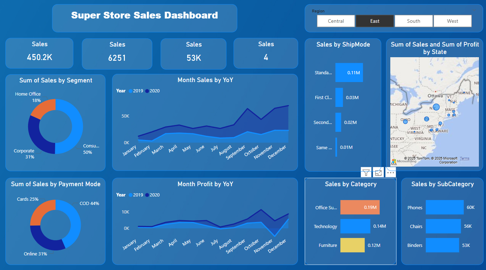

# Superstore Sales Dashboard

##  Overview
This Power BI dashboard analyzes Superstore sales performance across
regions, categories, segments, and time to uncover key business insights.

##  Key Metrics
- Total Sales: 450K+
- Orders: 6,251
- Quantity Sold: 53K
- Regions: Central, East, South, West

##  Key Insights
- Consumer segment contributes the highest sales (~50%)
- Technology is the top-performing category
- Sales peak during Q4
- Standard Class is the most used shipping mode

##  Tools Used
- Power BI Desktop
- DAX
- Data Modeling
- Data Visualization

## Dashboard Preview

### Overview

### Month Sales & Profit by Year-over-Year

## Key Insights
- Sales show a steady year-over-year growth trend, with a significant increase during the last quarter, indicating strong seasonal demand.
- Profit follows a similar upward pattern but experiences fluctuations mid-year, suggesting margin pressure from discounts or operational costs.
- The highest sales and profit are observed in December, making Q4 the most critical period for revenue and profitability.

